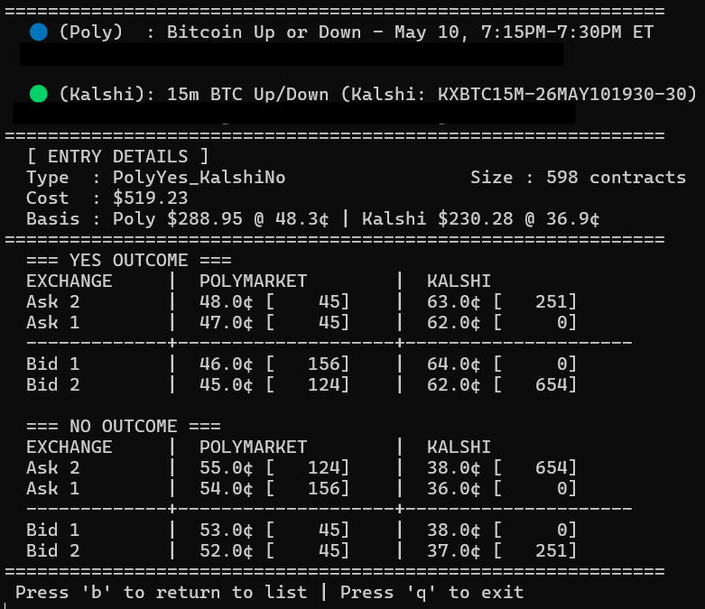

# Cross Exchange Prediction Market Arbitrage Engine

A fully automated, market-neutral trading system designed to identify and execute statistical arbitrage opportunities across decentralized and traditional prediction markets (Polymarket & Kalshi). 

This project was built to apply university-level financial theory to real-world market microstructure, focusing heavily on rigorous risk management, capital efficiency, and automated portfolio rebalancing.

## 📌 Executive Summary

The core objective of this engine is **Capital Preservation and Risk-Free Yield Generation**. By simultaneously purchasing opposing contracts on disparate exchanges, the system locks in a guaranteed $1.00 payout at maturity for a combined cost of less than $1.00. 
 
Rather than taking directional market risk, the engine capitalizes on pricing inefficiencies, bid-ask spread dislocations, and liquidity fragmentation between platforms.
 
 
## 🏦 Core Financial Mechanics

While the system handles complex asynchronous order routing, the underlying logic is built strictly on institutional portfolio management principles:

* **Dynamic Risk Scaling (Logarithmic Sizing):** Position sizing is dynamically calculated using a logarithmic curve based on total available equity. As the portfolio grows, the percentage of capital risked per trade mathematically scales down, preventing ruin and ensuring strict exposure limits.
* **Capital Velocity & Opportunity Cost:** The portfolio manager actively monitors open positions against new market opportunities. It calculates the exact "Switching Premium" (the absolute dollar cost of crossing the bid-ask spread to liquidate an active trade early) and only authorizes capital rotation if the new absolute yield mathematically clears the spread friction and a hardcoded alpha hurdle.
* **Market-Neutral Delta Hedging:** The execution engine utilizes anchored sequential legging. It fills the most illiquid exchange first, executing the secondary hedge immediately after. If an execution "orphans" (one side fills, the other fails), the system automatically triggers an emergency market-dump to flatten the directional delta and protect the portfolio.
* **Algorithmic Anomaly Quarantine:** To protect against "too-good-to-be-true" structural spreads or oracle halts, the system implements a volatility circuit breaker and quarantines massive statistical outliers for manual portfolio manager review.

## ⚙️ Technical Architecture Overview

This project is built in **TypeScript/Node.js** with a **MongoDB** persistence layer. It features a complete pipeline from machine-learning-driven market discovery (using transformer neural networks and LLMs for semantic matching) to real-time WebSocket order book monitoring and custom API execution clients.

For a deep dive into the system's asynchronous loops, database schema, and LLM verification logic, please refer to the [System Architecture Documentation](architecture.md).

## 🚀 Getting Started

1. Clone the repository and run `npm install`.
2. Configure your `.env` file with the required API keys and wallet addresses (see `architecture.md` for exact specifications).
3. Ensure a local or cloud instance of MongoDB is running.
4. Launch the live dashboard and execution engine via `ts-node src/index.ts`.

*(Note: The system includes a high-fidelity Paper Trading mode to simulate execution latency and order book sweeps without risking live capital).*
